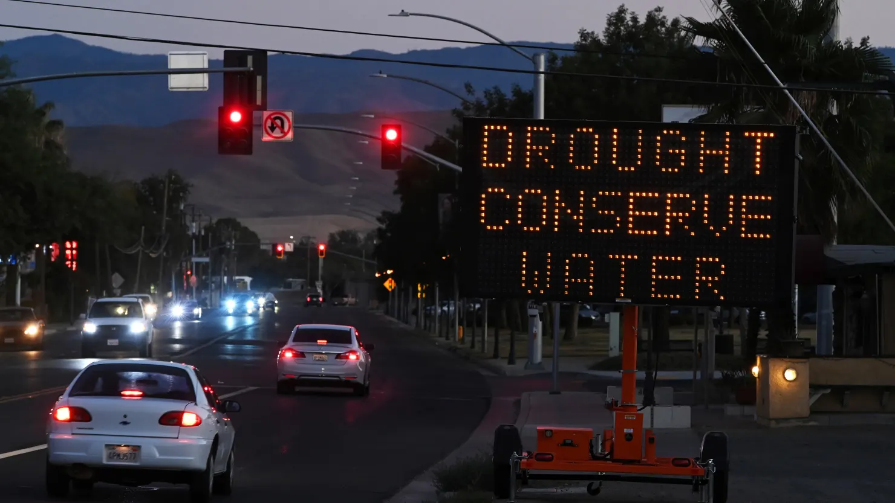

```{r}
# Upload picture

```

Sign informing residents to conserve water on Saturday August 27, 2022 in Coalinga, CA.

Source: The Washington Post

## Study Background

The city of Coalinga, located in the heart of California's San Joaquin Valley, faced a severe water crisis in 2022 as drought conditions worsened. To ensure that residents had access to water, the city was forced to make unprecedented purchases at escalating costs, highlighting the financial strain on its water supply system.

In this blog, I will explore the question: *How does drought impact the economy of a small community?* The data analyzed focuses on the effects of the 2022 drought, specifically the volume and cost of water purchased. These datasets were sourced from the California Department of Water Resources and the Nasdaq Veles California Water Index, respectively. By examining Coalinga’s water purchases, price fluctuations, and regional drought reports, I aim to better understand the pressures faced by local water systems. Through visualizations, I will highlight how smaller communities are disproportionately impacted by environmental challenges and emphasize the broader economic consequences of water scarcity.

### Data Details

**1. Water Shortage Levels**

Source: California Department of Water Resources

Description: This table reports the monthly state standard shortage level by urban retail water suppliers, which are generally defined as agencies serving over 3,000 service connections or deliveries 3,000 acre-feet of water annually for municipal purposes. These data are collected by the State Water Resources Control Board through its monthly Conservation Reporting and the data included in this dataset represent a small component of the larger dataset.

**2. California Water Index (NQH2O)**

Source: Nasdaq Veles California Water Index (NQH2O)

Description: The NQH2O tracks water rights lease and sale prices in California’s key water markets. It reflects the average price per acre-foot of water in five major regions, adjusting for factors like transaction types and market conditions, and is measured in U.S. dollars per acre-foot (325,851 gallons).

### References

**Water Shortage Levels**

California Department of Water Resources. (2024). Making Urban Water Data Public and Useful for Understanding Drought Impacts \[Data set\]. FlowWest. Retrieved February 15, 2025, from https://github.com/FlowWest/urban-water-drought-data

**Nasdaq Veles California Water Index (NQH2O)**

Nasdaq. (2025). Nasdaq Veles California Water Index (NQH2O) \[Data set\]. Retrieved February 15, 2025, from https://www.nasdaq.com/market-activity/index/nqh2o

## Coalinga Water Crisis - Infographic

```{r}
# Upload picture
knitr::include_graphics("data/infographics2.jpg")
```

## Decision-Making Process for Visualization

When creating data visualizations, every design choice plays a key role in how effectively the message is communicated. In this project, I considered various elements such as graphic form, color choices, text annotations, and accessibility. To ensure inclusivity in this blog, I used the "fig.alt" attribute to provide alternative text for my visualizations, making them accessible to all users, including those with visual impairments.

In applying a DEI (Diversity, Equity, and Inclusion) lens to my design, I was mindful of the communities and regions represented in the data. Water scarcity issues affect a range of populations across California, and the data selection decision I made aimed to highlight these disparities in small communities. Given that the central theme of this project revolves around drought, I selected a color palette from the yellow-red spectrum, evoking a sense of dryness/desert-like conditions.

Below, I outline the design choices I made for each of the visualizations:

**Nasdaq Veles California Water Index (NQH2O)**

When creating this data visualization for the Nasdaq Veles California Water Index (NQH2O), I chose a time series line plot, which is ideal for tracking how water prices have changed over time. The line plot effectively highlights trends, fluctuations, and significant events—such as the drought event in 2022—that may have impacted the price.

To emphasize the 2022 period, I used geom_area() with an orange fill and alpha transparency to shade the area under the curve. Additionally, I added a geom_rect() to overlay a transparent red rectangle over the year 2022, further drawing attention to the critical period. By combining these elements, I aimed for a clean and simple design, avoiding unnecessary clutter.

I also placed annotations to highlight events, such as the 2022 drought, other annotations were added on Affinity to explain what dictates the fluctuations in price.

**Shortage Levels Across California**

This bar graph visualizes the varying water shortage levels for different water suppliers across California, illustrating the severity of water scarcity in specific regions. Each bar represents a water supplier, with the y-axis displaying the supplier names and the x-axis indicating the shortage levels, ranging from low to high risk.

The graph employs a color gradient that spans from yellow (indicating low risk) to firebrick red (high risk), communicating the degree of water scarcity. The gradient color scale is complemented by custom labels, making it easy for viewers to interpret the level of risk.

Additionally, this graph was designed to be paired with a map that geographically shows the regions most affected by water scarcity, providing a spatial context to the data. Together, these elements make it easy to compare regions and understand the distribution of water shortage risk across the state.

**Historical Water Produced/Purchased Percentages**

This visualization focuses on the percentage breakdown of water types for Coalinga City's water system in 2022. It presents the proportion of water produced from various sources, using bars to represent the distribution between surface water and purchased water. The x-axis lists the water types, and the y-axis shows the percentage of total water produced in 2022, with the scale adjusted between 0% and 100%.

The data was grouped and summarized based on the water types, and the percentages were presented in a simple bar plot. To add a playful touch, I converted the bars into drinking glasses on Affinity Designer, where the percentage full of each glass visually represents the proportion of each water type. This twist adds a fun element to the infographic while effectively communicating the data.

## Code to create visualizations

The following scripts were used to generate the visualizations in the infographics. You can explore the complete code by expanding the chunk below. If required, you may also inspect the visualizations to read the detailed descriptions of each graph.

Import libraries

<details>

<summary>Click to view code</summary>

```{r eval = TRUE, echo = TRUE, warning=FALSE, message=FALSE}
# Load libraries
library(here)
library(ggplot2)
library(dplyr)
library(janitor)
library(ggridges)
library(tidycensus)
library(tidyverse)
library(lubridate)
library(gt)
```

</details>

Load Data

<details>

<summary>Click to view code</summary>

```{r eval = TRUE, echo = TRUE, warning=FALSE, message=FALSE}
# Read data
waterprice <- read_csv(here('data/HistoricalData_waterprice.csv'))

# Drop rows NaN values
waterprice <- drop_na(waterprice, price)
waterprice <- drop_na(waterprice, Date)

# Convert  Date column to Date type
waterprice$Date <- as.Date(waterprice$Date, format = "%m/%d/%Y")

historical <- read_csv(here('data/historical_production_delivery.csv'))
shortage <- read_csv(here('data/actual_water_shortage_level.csv'))
```

</details>

Shortage Level Bar Graph

<details>

<summary>Click to view code</summary>

```{r eval = TRUE, echo = TRUE, warning=FALSE, message=FALSE}
# Create shortage level dataframe
city_data <- shortage %>%
  mutate(year = year(end_date), month = month(end_date)) %>% # Create a column for year
  select(supplier_name, state_standard_shortage_level, year, month) %>% # Select key columns
  filter(
    year == 2022,
    month == 12,
    supplier_name %in% c(
      'california american water company - sacramento district', 
      'california water service company south san francisco', 
      'city of coalinga', 
      'california water service company bakersfield', 
      'los angeles city department of water and power', 
      'city of san diego'
    ) # Specify which water districts will be studied
  )
  

# Make city column a factor 
city_data$supplier_name <- factor(city_data$supplier_name , levels = city_data$supplier_name)
```

```{r}
# Create a new column to define the order
city_data <- city_data %>%
  mutate(order_col = case_when(
    supplier_name == 'california american water company - sacramento district' ~ 1,
    supplier_name == 'california water service company south san francisco' ~ 2,
    supplier_name == 'city of coalinga' ~ 3,
    supplier_name == 'california water service company bakersfield' ~ 4,
    supplier_name == 'los angeles city department of water and power' ~ 5,
    supplier_name == 'city of san diego' ~ 6
  ))

# Reverse the order in the factor levels to make the plot start from 1 at the top
city_data <- city_data %>%
  mutate(supplier_name = factor(supplier_name, levels = rev(city_data$supplier_name[order(city_data$order_col)])))

# Create the bar plot, using order_col to control the order of supplier_name
bar_graph <- ggplot(city_data, aes(x = state_standard_shortage_level, y = supplier_name, fill = state_standard_shortage_level)) +
  geom_bar(stat = "identity") +  # Create bars
  geom_text(aes(label = state_standard_shortage_level),  # Add text labels
            hjust = -0.1,  # Position the labels to the right of the bars
            size = 3.5,
            fontface = "bold") +  
  scale_fill_gradient(low = "yellow1", high = "firebrick", 
                      breaks = c(1, 5), 
                      labels = c("Low Risk", "High Risk")) +  # Custom legend labels
  theme_minimal() +
  labs(x = "Shortage Level", y="Water District", fill = "Shortage Risk Level") +  # Add title for the legend
  theme(
    axis.text.x = element_blank(),  # Remove x-axis labels
    axis.ticks.x = element_blank(),  # Remove x-axis ticks
    legend.position = "right",  # Place the legend on the right
    panel.grid.major = element_line(color = "gray", size = 0.5),  # Add major gridlines
    panel.grid = element_blank()  # Keep the gridlines visible for both axes
  )
```

</details>

```{r fig.alt = "This bar graph illustrates the water shortage levels (ranging from 0 to 6) across various regions in California, including Sacramento District, San Francisco, City of Coalinga, Bakersfield, Los Angeles City, and City of San Diego. Level 0 indicates low risk, while level 6 represents high risk. The City of Coalinga is shown at a risk level of 5, indicating a drought event, while other cities range from levels 1 to 3", fig.asp=0.6, warning=FALSE, message=FALSE}
bar_graph
```

# Historical Water Produced/Delivered Percentages

Data Wrangle

<details>

<summary>Click to view code</summary>

```{r eval = TRUE, echo = TRUE, warning=FALSE, message=FALSE}
# add new column `year`
historical$year <- year(ymd(historical$start_date))

district_historical<-'coalinga-city'

# Water Source
historical_watersource <- historical %>%
    filter(water_system_name == district_historical, water_produced_or_delivered == 'water produced', year==2022)%>%
  group_by(water_type) %>%
  summarise(total_quantity = sum(quantity_acre_feet, na.rm = TRUE)) %>%
  mutate(total_yearly_quantity = sum(total_quantity, na.rm = TRUE),  # Calculate total quantity
         percent = (total_quantity / total_yearly_quantity) * 100) # Calculate %

# Create the bar plot
#Select the only existing water source, based on the table: Surface Water & Purchased Water
bar_data <- historical_watersource %>%
  filter(water_type == "surface water" | water_type == "purchased or received from another pws")

# Create the bar plot
barplot <- ggplot(bar_data, aes(x = water_type, y = percent)) +
    geom_bar(stat = "identity", position = position_dodge(width = 1), width = 0.9, fill = "steelblue") +  # Bar plot with dodged bars
    labs(title = "City of Coalinga: Water Type Percentages in 2022", x = "Water Type", y = "Percentage (%)") +
    theme_minimal() +
    theme(legend.position = "none",  # Hide legend 
        panel.grid.major = element_blank(),  # Remove major gridlines
        panel.grid.minor = element_blank() ) +  # Remove minor gridlines
    ylim(0, 100)


```

</details>

```{r fig.alt = "The bar plot depicts the percentage distribution of water sources in Coalinga City for 2022. Surface water constitutes 65% of the total water supply, while 35% was purchased", fig.asp=0.7, warning=FALSE, message=FALSE}

barplot
```

Tables

<details>

<summary>Click to view code</summary>

```{r eval = TRUE, echo = TRUE, warning=FALSE, message=FALSE}
# Table 1: Water Source (water produced)
historical_watersource_table <- historical_watersource %>%
  gt() %>%
  tab_header(
    title = "Water Source - Water Produced"
  ) %>%
  cols_label(
    water_type = "Water Type",
    total_quantity = "Total Quantity (Acre-feet)",
    percent = "Percentage of Total"
  )  %>%
  fmt_number(
    columns = c("total_quantity", "percent"),
    decimals = 2
  )

```

</details>

```{r eval = TRUE, echo = TRUE, warning=FALSE, message=FALSE}
# Display table
historical_watersource_table
```

# Historical Water Price Plot

<details>

<summary>Click to view code</summary>

```{r eval = TRUE, echo = TRUE, warning=FALSE, message=FALSE}
# Create the time series plot with a transparent red shaded area for 2022 and a drought annotation
timeseries <- ggplot(waterprice, aes(x = Date, y = price)) +
  # Fill the area under the line with orange color with alpha for transparency
  geom_area(fill = "orange", alpha = 0.6) +  
  
  geom_line(color = "firebrick") +  # Add the line plot on top

  labs(
    title = "Nasdaq Veles California Water Index (NQH2O)",
    x = "Date",
    y = "$USD/Acre-ft",
    caption = "Source: Nasdaq"
  ) +
  
  theme_minimal() +
  
  # Highlight the area for 2022 with transparent red
  geom_rect(aes(xmin = as.Date("2022-01-01"), xmax = as.Date("2022-12-31"), ymin = 0, ymax = 1500), alpha = 0.002, fill = "firebrick") +  # Transparent red for the year 2022
  
  # Add the "Drought Event" label to the shaded rectangle
  annotate("text", x = as.Date("2022-06-01"), y = max(waterprice$price) * 0.9, label = "Drought Event", 
           vjust = -7.8, hjust = 0.4, color = "red", size = 4) +
  
  theme(
    plot.title = element_text(hjust = 0.5, face = "bold"),  # Center and bold the title
    plot.background = element_rect(fill = "white", color = "black", size = 1)
  )
```

</details>

```{r fig.alt = "This time series shows the historic Nasdaq Veles California Water prices from 2020-2025. It highlights the drought periods in 2022 showing that the prices spiked from ~$750/ acres-feet in Dec.2021 to $1250/acres-feet in June 2022 ", fig.asp=0.7, warning=FALSE, message=FALSE}
timeseries
```
